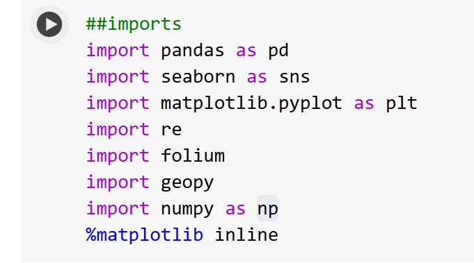
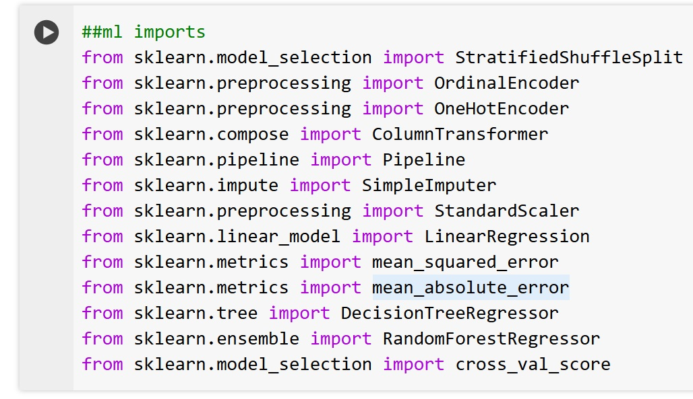

# San Francisco Rent Analysis
This project is for my CS133 Introduction to Data Visualization class. The code performs data cleaning, exploratory analysis, model training, and evaluation.

Project Members: Charlene Khun, Helena Thiessen, Benny Chen, and Rongjie Mai

How to Run the Code
1. Install the necessary Libraries: Ensure you have the following Python libraries installed: pandas, seaborn, matplotlib, re, folium, geopy, scikit-learn, and scipy. 
You can install them using pip: pip install pandas seaborn matplotlib re folium geopy scikit-learn scipy OR !pip install pandas seaborn matplotlib folium geopy scikit-learn scipy (when using Jupyter Notebooks on Google Colab).

Below, are some main imports that we used in the project.

Please be sure to check for any additional imports in the Google Colab file.

2. Access the Dataset: Obtain the Rent Board Housing Inventory dataset from the provided URL from the “References” page on page 16 of the report. 
3. Execute the Code: Run the Python code blocks in a Jupyter Notebook (from Google Colab) or a similar environment. The code performs data cleaning, exploratory analysis, model training, and evaluation.
4. Interpret Results: Analyze the generated visualizations, model performance metrics, and feature importances to gain insights into San Francisco's rental market trends.

