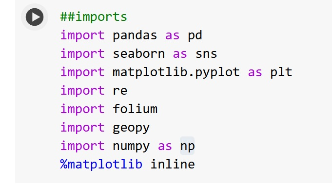
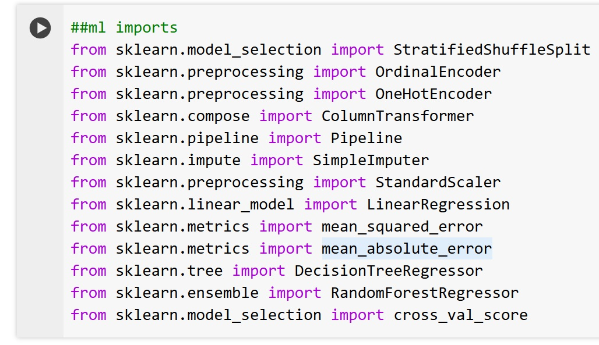

# San Francisco Rent Analysis
This project is for my CS133 Introduction to Data Visualization class. We chose to perform data analysis and machine learning techqniues on the San Franciso Rent Board Housing Inventory by Data SF (https://datasf.org/opendata/ & https://data.sfgov.org/Housing-and-Buildings/Rent-Board-Housing-Inventory/gdc7-dmcn/about_data).

From a business and policy perspective, the project addresses the challenge of turning a large housing dataset into useful information for understanding rental market patterns and property characteristics. A potential stakeholder could be a housing policy analyst, city planning department, real estate analyst, or housing organization interested in understanding how different property features relate to rental housing conditions in San Francisco. The problem we were solving was how to identify meaningful trends in the data and determine which features were most useful for explaining or predicting rental-related outcomes.

The analysis supports decisions about which housing characteristics deserve the most attention when evaluating rental market conditions, identifying patterns across properties, or prioritizing further analysis. By combining visualizations with machine learning models and feature importance analysis, the project helps stakeholders move beyond raw housing records and identify factors that may be useful for policy analysis, market research, or housing-related decision-making. The broader takeaway is that public housing data can be transformed into actionable insights that help organizations better understand the structure and trends of the San Francisco rental market.

Project Members: Charlene Khun, Helena Thiessen, Benny Chen, and Rongjie Mai

How to Run the Code
1. Install the necessary Libraries: Ensure you have the following Python libraries installed: pandas, seaborn, matplotlib, re, folium, geopy, scikit-learn, and scipy. You can install them using pip: pip install pandas seaborn matplotlib re folium geopy scikit-learn scipy OR !pip install pandas seaborn matplotlib folium geopy scikit-learn scipy (when using Jupyter Notebooks on Google Colab).
   Below, are some main imports that we used in the project. Please be sure to check for any additional imports in the Google Colab file.
  
  

2. Access the Dataset: Obtain the Rent Board Housing Inventory dataset from the provided URL from the “References” page on page 16 of the report. Specifically, we decided to use the data from April 8th, 2025. https://raw.githubusercontent.com/tlena43/DataVis/refs/heads/main/Rent_Board_Housing_Inventory_20250408.csv
3. Execute the Code: Run the Python code blocks in a Jupyter Notebook (from Google Colab) or a similar environment. The code performs data cleaning, exploratory analysis, model training, and evaluation.
4. Interpret Results: Analyze the generated visualizations, model performance metrics, and feature importances to gain insights into San Francisco's rental market trends.

Google Slides Presentation Link: https://docs.google.com/presentation/d/16u5aS-wXF_4LMRcbMaler-4i80XG81FnjfntioHUIDc/edit?usp=sharing
